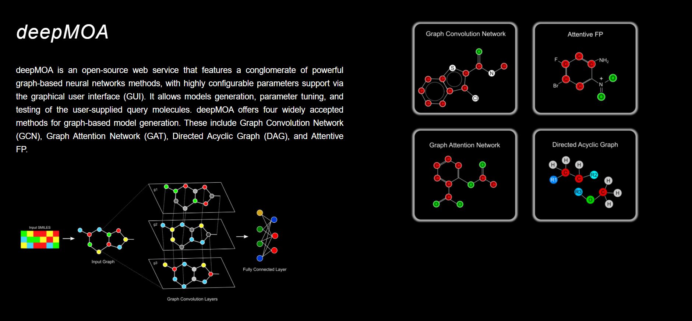

 <h1><I>deepMOA</I> </h1> 

  

   
Artificial intelligence-based computational techniques allow the rapid exploration of the chemical space. Recent algorithmic advancements in modeling neural networks provide an automatic and extraordinary means for molecule representation, in contrast, to traditional manually designed fingerprints or descriptors. Although the implementation of graph-based methods for chemical properties calculation offers multiple advantages, its implementation demands in-depth domain knowledge and programming skills. To address this, here we introduce deepMOA, an end-to-end web service featuring a conglomerate of powerful graph-based neural networks methods for model generation for classification or regression tasks. The Graphical User Interface of deepMOA supports highly configurable parameters support for model tuning, generation, and testing of the user-supplied query molecules. <I>deepMOA</I> supports four widely accepted methods for graph-based model generation i.e., Graph Convolution Network (GCN) (Duvenaud et al., 2015), Graph Attention Network (GAT) (Veličković et al., 2018), Directed Acyclic Graph (DAG) (Ha, Sun and Xie, 2016), and AttentiveFP (Xiong et al., 2020). Importantly, for all the aforementioned methods, deepMOA also supports cross-validations and returns comprehensive results, both in graphical as well as tabular formats. One of the key highlighting features of deepMOA is that it allows live tracking of the main steps involved in the model generation. To our knowledge, deepMOA is the first open-source and multi-functional graph-based deep learning framework supporting web service to date. 
  

**Webserver is freely available at https://deepmoa.ahujalab.iiitd.edu.in**

The source code of the embeddings needed to train the model is available at  https://github.com/the-ahuja-lab/deepMOA

## Prediction Engines:

## Additional Features:
1. <I>deepMOA</I> is a one-stop web service for graph-based methods for cheminformatics
2. <I>deepMOA</I> is one of the only open-source web servers to date that provides multiple GUI-based options for graph-based QSAR analysis. 
3. <I>deepMOA</I> is backup by significant computational resources to enable model generation on larger datasets.
4. <I>deepMOA</I> allows users to temporarily store their data for up to 1 month.
5. <I>deepMOA </I>is open source and free to use.

